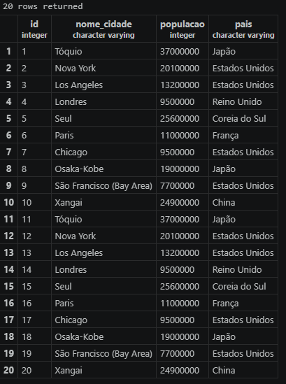

### passo a passo para a tabela 
para fazer a tabela primeiro temos que fazer o codigo somente da tabela apos isso, fazemos outro codigo para adicionar as cidades e os numeros a tabela.

- 
CREATE TABLE cidades_ricas (
    id SERIAL PRIMARY KEY,
    nome_cidade VARCHAR(100) NOT NULL,
    populacao INTEGER,
    pais VARCHAR(100) NOT NULL
);

### incerindo as cidades na tabela

-
INSERT INTO cidades_ricas (nome_cidade, populacao, pais) VALUES
('Tóquio', 37000000, 'Japão'),
('Nova York', 20100000, 'Estados Unidos'),
('Los Angeles', 13200000, 'Estados Unidos'),
('Londres', 9500000, 'Reino Unido'),
('Seul', 25600000, 'Coreia do Sul'),
('Paris', 11000000, 'França'),
('Chicago', 9500000, 'Estados Unidos'),
('Osaka-Kobe', 19000000, 'Japão'),
('São Francisco (Bay Area)', 7700000, 'Estados Unidos'),
('Xangai', 24900000, 'China');

- Imagem do resultado final da tabela:

