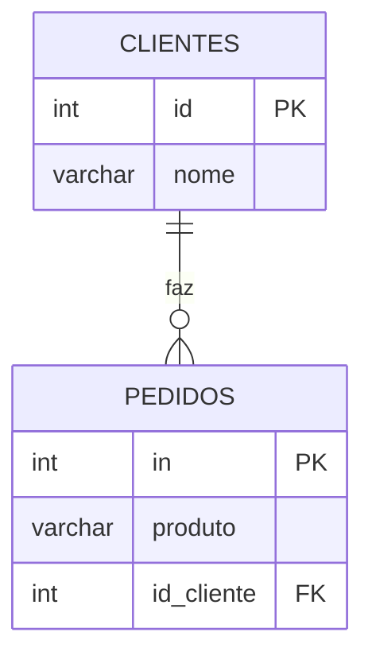

# Aula - Relacionamento de Tabelas 

## Ideia principal
- **Clientes**: que compra.
- **Pedidos**: aquilo que foi vendido.
- cada pedido, guarda o **Numero do cliente** (id), não o seu nome.
- o **Join** junta duas tabelas para mostrar o nome do cliente do lado do seu pedido.

## Diagrama



- **PK**: o numero que indentifica cada cliente e cada pedido.
- **FK**: (chave estrangeira) o numero que ira apontar para a outra tabela.
- ||--o{ significa que um cliente podera ter varios pedidos.


2 - CRIAMOS A TABELA PEDIDOS (criando a chave estrangeira):

```sql
CREATE TABLE pedidos (
    id SERIAL PRIMARY KEY,
    producto VARCHAR(100) ,
    id_cliente INT REFERENCES clientes(id),
);
```


3 - inserimos os clientes (Daniel nao vai comprar nada na cantina)
```sql
INSERT INTO clientes (nome) VALUES 
('caio'),
('carla'),
('Daniel')
``` 

4 - inserimos produtos para os clientes:
```sql
INSERT INTO pedidos(produto, id_cliente) VALUES 
('pão de queijo',2),
('café expresso',2),
('almoço',1),
```

5 - comando INNER JOIN.
```sql
SELECTE clientes.nome, pedidos.produto 
FROM pedidos 
INNER JOIN clientes ON pedidos.id_cliente = clientes.id;
```
- o DANIEL não aparece, pois nao possui pedido algum.

6 - comando LEFT JOIN 
```sql
SELECT clientes.nome, pedidos.produto
FROM clientes
LEFT JOIN pedidos ON clientes.id = pedidos.id_cliente;
```
o LEFT JOIN: mostra tudo da tabela da esquerda  (basicamente, é a tabela apos o FROM).
