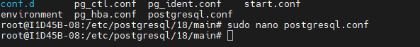
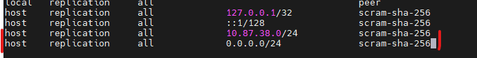

## Configurando o SGBD
SGBD: Sistema Gerenciador de Bando de Dados
para acesso inicial utilisamos o comando:

```bash 
sudo -u postgre psql
```
>Autenticação via linux, não necessita de senha 

apos o primeiro acesso, alteramos a senha atraves do comando:
```sql
ALTER USER postgres PASSWORD '1234';
```
para sair do SGBD utilizamos o comando : '\q'
>Comando famoso:\quit em games 

para acesso externo, utilizamos o comando:
```bash
sudo psql -h 127.0.0.1 -U postegres 
```
---
alteraçoes nos arquivos:
1. navegamos ate o caminho:
```bash
cd /etc/postgresql/18/main
```
2. editamos o arquivo postgresql.conf atraves do comando:
sudo nano postgresql.conf

linha sisiten_adresses = '*'
>para pesquisar linha : 'ctrl+w'


3.segunda alteração no arquivo ph_hba.conf:
```bash
sudo nano pg_hba.conf
```
4.alterações realizadas:


5.poque utilizamos o 0.0.0.0./24:
utilizamos para liberar para todos poderem entrar pois o 0 e um numero neutro 

\l = lista de dados 

6. codigos:

 sudo systemctl restart postgresql
 
> restarta a aplicação 

.sudo systemctl status postgresql

>verifica o status da aplicação

---

7. comandos em SQL, letras maiusculas 


