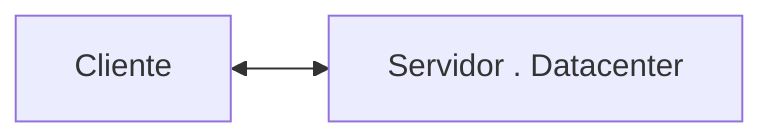
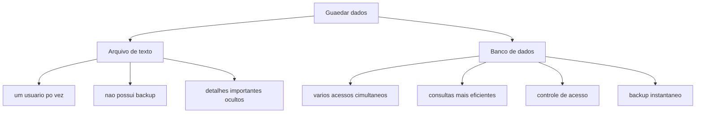
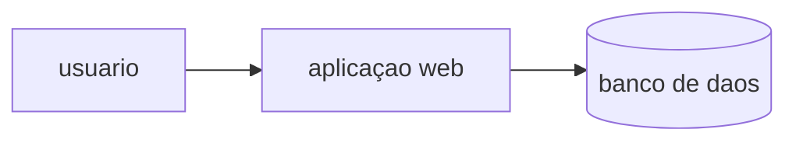

## servidor de desinvolvimento 
sera uma inrterface de desilvolvimento utilizada para aplicaçoes e banco de dados 


---
## Servidor de Arquivos Educacional
É um servidor para armazenar arquivos e facilitar na hora de realizar a transferencia.

>o endereço para acesso ao servidor de arquivos é: `\\10.87.36.10`.

>credenciais de acesso:,E-mail:aluno, senha: aluno 

---
## servidor pessoal 
o moba sera a interfacepara acesso ao meu servidor de desinvolvimento 
>o acesso sera realizado via ssh 

>credenciais de acesso:`ip:192.168.10.82 e senha "1234"

```bash passwd```

recurso|configuraçao |----|-------|processador|2 core|
|RAM||512MB|
|armazenamento|6gb|
|sistema operaciuonal|ubuntu 26.04|LTS|

para visualizaçao do uso de rescursos utilisamos o comando ```bash HTOP```
---
a utilizaçao de um servidor de desinvolvimento simula um ambiente real de produçao 
os objetivos esperados sao :
-deploy de projetos,
-aplicaçao de dados,
-experiencia rela de mercado

## Banco De Dados 
antigamente os dados eram salvos em arquivos/planilhas.

---
>mas afinal onde entra o banco de dados em aplicaçoes web ?

---

---



```mermaid
graph TD 
A[SGBD - postgreSQL] -->B[(banco de dados)]
