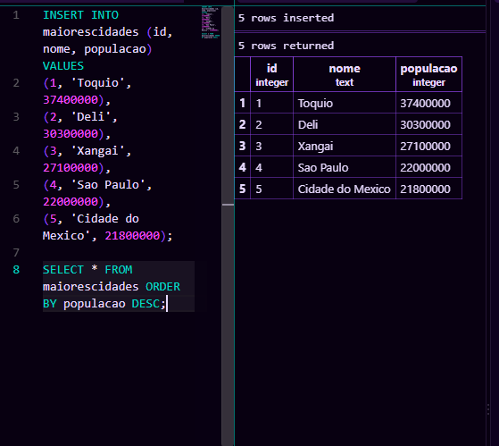

### passo a passo para fazer a criação da tabela 
codigo usado para fazer a criação da tabela.

CREATE TABLE maiorescidades (
    id INTEGER PRIMARY KEY,
    nome TEXT NOT NULL,
    populacao INTEGER NOT NULL
);

codigo usado para adicionar as cidades na tabela: 

INSERT INTO maiorescidades (id, nome, populacao) VALUES
(1, 'Toquio', 37400000),
(2, 'Deli', 30300000),
(3, 'Xangai', 27100000),
(4, 'Sao Paulo', 22000000),
(5, 'Cidade do Mexico', 21800000);

SELECT * FROM maiorescidades ORDER BY populacao DESC;