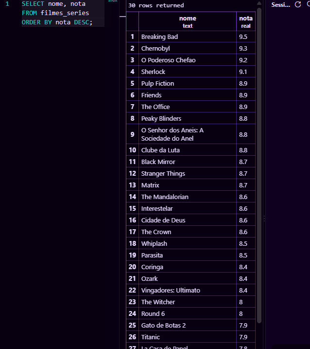
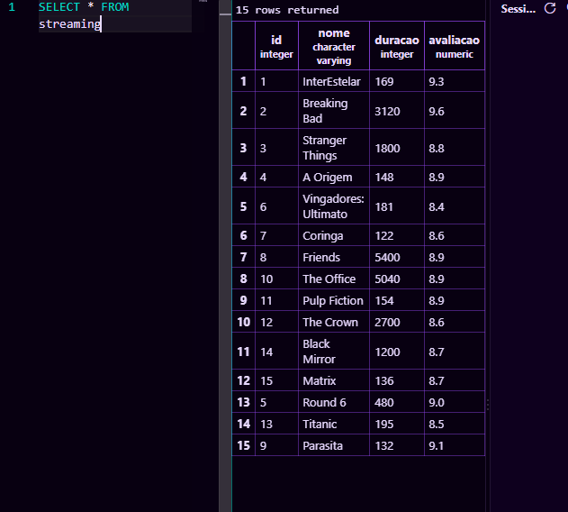

--CREATE TABLE filmes_series (
   -- id INTEGER PRIMARY KEY,
    --nome TEXT NOT NULL,
    --duracao INTEGER NOT NULL,
    --nota REAL NOT NULL
--);

INSERT INTO filmes_series (id, nome, duracao, nota) VALUES
(1, 'Breaking Bad', 45, 9.5),
(2, 'O Poderoso Chefao', 175, 9.2),
(3, 'Stranger Things', 50, 8.7),
(4, 'Interestelar', 169, 8.6),
(5, 'Round 6', 55, 8.0),
(6, 'The Office', 22, 8.9),
(7, 'Cidade de Deus', 130, 8.6),
(8, 'Friends', 22, 8.9),
(9, 'O Senhor dos Aneis: A Sociedade do Anel', 178, 8.8),
(10, 'The Crown', 58, 8.6),
(11, 'Clube da Luta', 139, 8.8),
(12, 'Peaky Blinders', 60, 8.8),
(13, 'Pulp Fiction', 154, 8.9),
(14, 'The Mandalorian', 40, 8.6),
(15, 'Vingadores: Ultimato', 181, 8.4),
(16, 'Chernobyl', 60, 9.3),
(17, 'La Casa de Papel', 50, 7.8),
(18, 'Coringa', 122, 8.4),
(19, 'Black Mirror', 60, 8.7),
(20, 'Matrix', 136, 8.7),
(21, 'Ozark', 60, 8.4),
(22, 'Parasita', 132, 8.5),
(23, 'The Witcher', 60, 8.0),
(24, 'Whiplash', 106, 8.5),
(25, 'Sherlock', 88, 9.1),
(26, 'Gato de Botas 2', 102, 7.9),
(27, 'Titanic', 195, 7.9),
(28, 'Bridgerton', 60, 7.3),
(29, 'Emily em Paris', 30, 6.8),
(30, 'Riverdale', 42, 5.9);

somente nome e nota

troca de nota 
