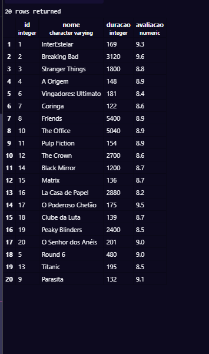
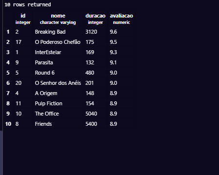
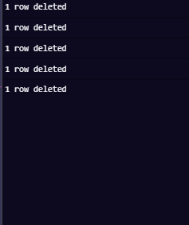
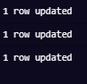
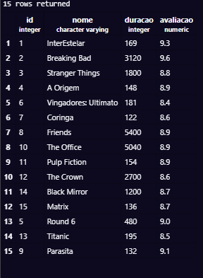

## Update e Delete 
**UPDATE** ou **DELETE** afetam todas as linhas da sua tabela. Logo **JAMAIS** executar sem o comando `WHERE`.

```mermaid
flowchart LR

A[SELECT com o WHERE] -->B {retornou a linha certa ?}
B -- SIM --> C[Update ou DELETE] 
B -- NÃ O--> A; 
```
---


---
**Criação da tabela**  

PRIMEIRO PASSO:
```sql 
CREATE TABLE streaming (
    id INT GENERATED ALWAYS AS IDENTITY PRIMARY KEY,
    nome VARCHAR(100),
    duracao INT,
   avaliacao DECIMAL(3,1)
   )
````
---


**Adicionando informações a tabela** 

SEGUNDO PASSO:
```sql
 
 INSERT INTO streaming VALUES

  (1,'InterEstelar',169,9.3),
  (2, 'Breaking Bad', 3120, 9.6),
  (3, 'Stranger Things', 1800, 8.8),
  (4, 'A Origem', 148, 8.9),
  (5, 'Round 6', 480, 8.0),
  (6, 'Vingadores: Ultimato', 181, 8.4),
  (7, 'Coringa', 122, 8.6),
  (8, 'Friends', 5400, 8.9),
  (9, 'Parasita', 132, 8.6),
  (10, 'The Office', 5040, 8.9),
  (11, 'Pulp Fiction', 154, 8.9),
  (12, 'The Crown', 2700, 8.6),
  (13, 'Titanic', 195, 7.9),
  (14, 'Black Mirror', 1200, 8.7),
  (15, 'Matrix', 136, 8.7),
  (16, 'La Casa de Papel', 2880, 8.2),
  (17, 'O Poderoso Chefão', 175, 9.5),
  (18, 'Clube da Luta', 139, 8.7),
  (19, 'Peaky Blinders', 2400, 8.5),
  (20, 'O Senhor dos Anéis', 201, 9.0);

```
---

**Fazendo a demonstração do 10 fimes melhores avaliados**

TERCEIRO PASSO:
```sql
 SELECT * FROM streaming WHERE avaliacao > 8.7;

````


---


** TEBELA COMPLETA SEM ALTERAÇÕES ^ **
  

---

** OS 10 MELHORES AVALIADOS ^ **
  

---

** REGISTROS APAGADOS ^ **
  

---


** ATUALIZAÇÃO DE NOTAS ^ **
  

---


** COMO FICOU ^ **
 
 
---


QUARTO PASSO:

```sql 
--UPDATE streaming SET avaliacao = 9.0 WHERE id = 5;
--UPDATE streaming SET avaliacao = 8.5 WHERE id = 13;
--UPDATE streaming SET avaliacao = 9.1 WHERE id = 9;
```

---


QUINNTO PASSO:

 ```sql
 DELETE FROM streaming WHERE id = 20;
DELETE FROM streaming WHERE id = 19;
DELETE FROM streaming WHERE id = 18;
DELETE FROM streaming WHERE id = 17;
DELETE FROM streaming WHERE id = 16;
```