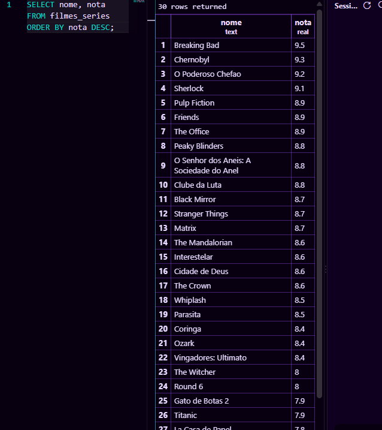
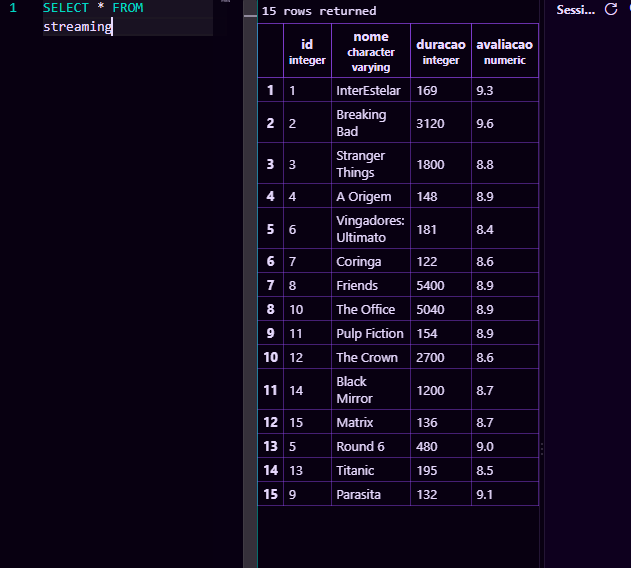

--CREATE TABLE filmes_series (
   -- id INTEGER PRIMARY KEY,
    --nome TEXT NOT NULL,
    --duracao INTEGER NOT NULL,
    --nota REAL NOT NULL
--);

INSERT INTO filmes_series (id, nome, duracao, nota) VALUES
(1, 'Breaking Bad', 45, 9.5),
(2, 'O Poderoso Chefao', 175, 9.2),
(3, 'Stranger Things', 50, 8.7),
(4, 'Interestelar', 169, 8.6),
(5, 'Round 6', 55, 8.0),
(6, 'The Office', 22, 8.9),
(7, 'Cidade de Deus', 130, 8.6),
(8, 'Friends', 22, 8.9),
(9, 'O Senhor dos Aneis: A Sociedade do Anel', 178, 8.8),
(10, 'The Crown', 58, 8.6),
(11, 'Clube da Luta', 139, 8.8),
(12, 'Peaky Blinders', 60, 8.8),
(13, 'Pulp Fiction', 154, 8.9),
(14, 'The Mandalorian', 40, 8.6),
(15, 'Vingadores: Ultimato', 181, 8.4),
(16, 'Chernobyl', 60, 9.3),
(17, 'La Casa de Papel', 50, 7.8),
(18, 'Coringa', 122, 8.4),
(19, 'Black Mirror', 60, 8.7),
(20, 'Matrix', 136, 8.7),
(21, 'Ozark', 60, 8.4),
(22, 'Parasita', 132, 8.5),
(23, 'The Witcher', 60, 8.0),
(24, 'Whiplash', 106, 8.5),
(25, 'Sherlock', 88, 9.1),
(26, 'Gato de Botas 2', 102, 7.9),
(27, 'Titanic', 195, 7.9),
(28, 'Bridgerton', 60, 7.3),
(29, 'Emily em Paris', 30, 6.8),
(30, 'Riverdale', 42, 5.9);

somente nome e nota

troca de nota 

-- SELECT * FROM streaming 

-- SELECT * FROM streaming WHERE avaliacao > 8.7;

--UPDATE streaming SET avaliacao = 9.0 WHERE id = 5;
--UPDATE streaming SET avaliacao = 8.5 WHERE id = 13;
--UPDATE streaming SET avaliacao = 9.1 WHERE id = 9;

--DELETE FROM streaming WHERE id = 20;
--DELETE FROM streaming WHERE id = 19;
--DELETE FROM streaming WHERE id = 18;
--DELETE FROM streaming WHERE id = 17;
--DELETE FROM streaming WHERE id = 16;

--CREATE TABLE streaming (
    --id INT GENERATED ALWAYS AS PRIMARY KEY,
    --nome VARCHAR(100),
    --duracao INT,
   -- avaliacao DECIMAL(3,1)
   --)

--INSERT INTO streaming VALUES

--(1,'InterEstelar',169,9.3),
--(2, 'Breaking Bad', 3120, 9.6),
--(3, 'Stranger Things', 1800, 8.8),
--(4, 'A Origem', 148, 8.9),
--(5, 'Round 6', 480, 8.0),
--(6, 'Vingadores: Ultimato', 181, 8.4),
--(7, 'Coringa', 122, 8.6),
--(8, 'Friends', 5400, 8.9),
--(9, 'Parasita', 132, 8.6),
--(10, 'The Office', 5040, 8.9),
--(11, 'Pulp Fiction', 154, 8.9),
--(12, 'The Crown', 2700, 8.6),
--(13, 'Titanic', 195, 7.9),
--(14, 'Black Mirror', 1200, 8.7),
--(15, 'Matrix', 136, 8.7),
--(16, 'La Casa de Papel', 2880, 8.2),
--(17, 'O Poderoso Chefão', 175, 9.5),
--(18, 'Clube da Luta', 139, 8.7),
--(19, 'Peaky Blinders', 2400, 8.5),
--(20, 'O Senhor dos Anéis', 201, 9.0);

  
 -- SELECT * FROM streaming ORDER BY avaliacao DESC LIMIT 10;