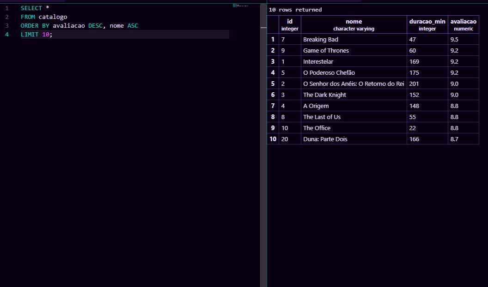
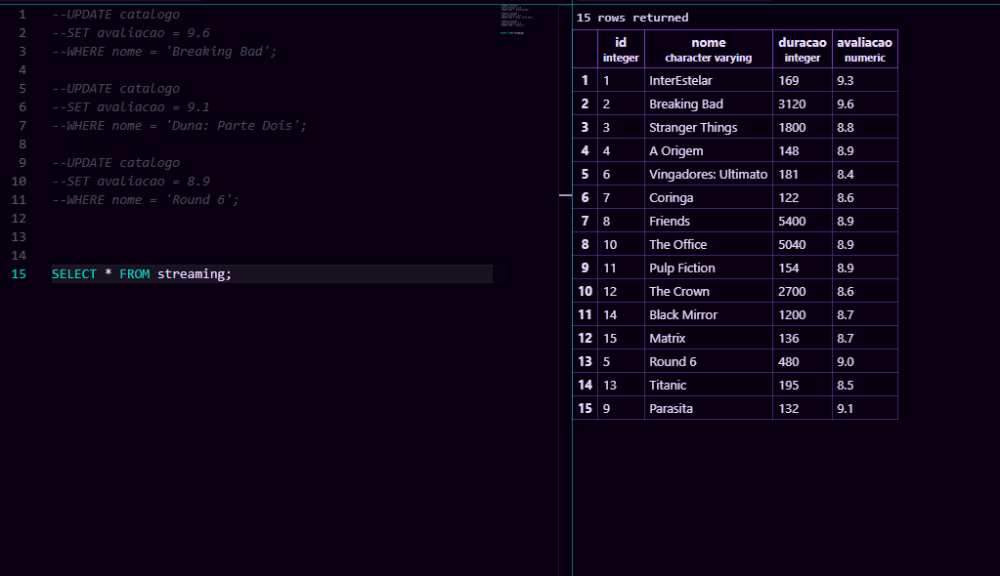
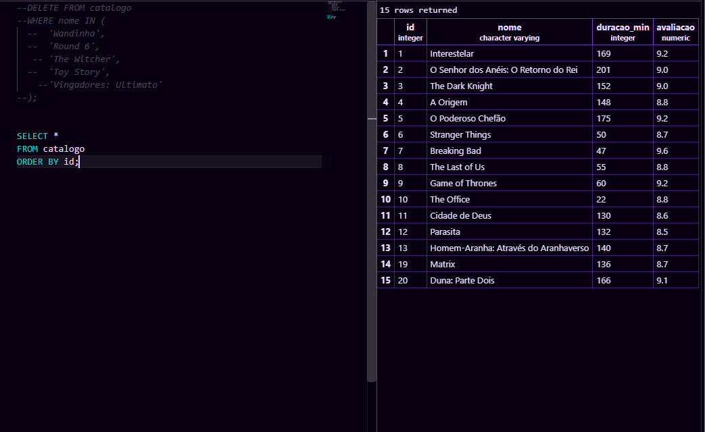

**criação da tabela**

CREATE TABLE catalogo (
    id INTEGER GENERATED ALWAYS AS IDENTITY PRIMARY KEY,
    nome VARCHAR(150) NOT NULL,
    duracao_min INTEGER NOT NULL,
    avaliacao NUMERIC(3,1) NOT NULL,
    CONSTRAINT avaliacao_valida
        CHECK (avaliacao >= 0 AND avaliacao <= 10)
);

**colocando os filmes**

INSERT INTO catalogo
(nome, duracao_min, avaliacao)
VALUES
('Interestelar', 169, 9.2),
('O Senhor dos Anéis: O Retorno do Rei', 201, 9.0),
('The Dark Knight', 152, 9.0),
('A Origem', 148, 8.8),
('O Poderoso Chefão', 175, 9.2),
('Stranger Things', 50, 8.7),
('Breaking Bad', 47, 9.5),
('The Last of Us', 55, 8.8),
('Game of Thrones', 60, 9.2),
('The Office', 22, 8.8),
('Cidade de Deus', 130, 8.6),
('Parasita', 132, 8.5),
('Homem-Aranha: Através do Aranhaverso', 140, 8.7),
('Vingadores: Ultimato', 181, 8.4),
('Toy Story', 81, 8.3),
('Wandinha', 45, 8.1),
('Round 6', 60, 7.8),
('The Witcher', 60, 8.0),
('Matrix', 136, 8.7),
('Duna: Parte Dois', 166, 8.7);

**exibir os 10 melhores avaliados**

SELECT *
FROM catalogo
ORDER BY avaliacao DESC, nome ASC
LIMIT 10;

**atualizar algumas notas**

UPDATE catalogo
SET avaliacao = 9.6
WHERE nome = 'Breaking Bad';

UPDATE catalogo
SET avaliacao = 9.1
WHERE nome = 'Duna: Parte Dois';

UPDATE catalogo
SET avaliacao = 8.9
WHERE nome = 'Round 6';

**apagar 5 registro**

DELETE FROM catalogo
WHERE nome IN (
    'Wandinha',
    'Round 6',
    'The Witcher',
    'Toy Story',
    'Vingadores: Ultimato'
);

